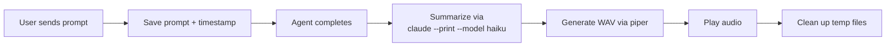

# talk-to-me

A Claude Code plugin that speaks a casual summary of what your session accomplished when the main agent finishes.

When you're running parallel agents and multitasking, it's easy to miss when Claude is done. This plugin summarizes the session via Claude CLI, then speaks it aloud in a natural voice — e.g., *"talk-to-me. Finished setting up piper TTS and committed the changes."*

## How it works



The plugin registers two hooks:

1. **UserPromptSubmit** — saves the user's prompt and a timestamp for each session
2. **Stop** — when the main agent finishes, checks elapsed time, reads the transcript, summarizes via `claude --print`, and speaks via piper TTS

Quick interactions (under 5 minutes) stay silent. Only longer tasks get announced.

Generated audio files are written to a PID-scoped temp directory (`/tmp/talk-to-me-tts/{pid}/`) and automatically cleaned up after playback completes.

If piper isn't installed, falls back to macOS `say` or Linux `espeak`.

## Quick start

After installing the plugin, run:

```
/talk-to-me:setup
```

This installs all dependencies (jq, piper, a voice model), then verifies the full pipeline.

## Requirements

Handled automatically by `/talk-to-me:setup`:

- **Claude CLI** — already installed (you're running Claude Code)
- **jq** — JSON parsing (`brew install jq` / `apt install jq`)
- **piper-tts** — neural text-to-speech (`pip install piper-tts`)
- A piper voice model (~65MB, downloaded during setup)

## Platform support

| Platform | TTS engine | Quality |
|----------|-----------|---------|
| macOS / Linux | **piper** (neural) | Natural, human-like |
| macOS | `say` (fallback) | Robotic but built-in |
| Linux | `espeak` / `spd-say` / `festival` (fallback) | Robotic but built-in |

Piper is recommended. It's fast (sub-second), cross-platform, and sounds natural. The plugin auto-detects the best available engine.

## Installation

### From GitHub (recommended)

In Claude Code, run:

```
/plugin marketplace add IsuruDR/talk-to-me
```

Then install the plugin:

```
/plugin install talk-to-me@talk-to-me
```

Restart Claude Code, then run `/talk-to-me:setup` to install dependencies and register hooks.

**`/talk-to-me:setup` is required** — it installs piper, downloads a voice model, and registers the Stop/UserPromptSubmit hooks in your settings. The plugin will not work without running setup first.

### From a local clone

```sh
git clone https://github.com/IsuruDR/talk-to-me.git
```

In Claude Code:

```
/plugin marketplace add /path/to/talk-to-me
/plugin install talk-to-me@talk-to-me
```

Restart Claude Code, then run `/talk-to-me:setup` to install dependencies and register hooks.

## Configuration

Use the `/talk-to-me:voice` command inside Claude Code to configure everything interactively.

```
/talk-to-me:voice                    # Interactive setup — engine, voice, and duration
/talk-to-me:voice list               # List available engines and voices
/talk-to-me:voice preview Sam        # Preview a specific voice
/talk-to-me:voice engine piper       # Set the TTS engine
/talk-to-me:voice duration 30        # Set minimum duration before speaking (seconds)
/talk-to-me:voice reset              # Reset to system defaults
```

### Config file

Settings are stored in `~/.config/talk-to-me/config.json`:

```json
{
  "tts_engine": "piper",
  "piper_voice": "en_US-lessac-high",
  "voice": "Daniel",
  "min_duration": 300
}
```

| Field | Description | Default |
|-------|------------|---------|
| `tts_engine` | TTS engine (`piper`, `say`, `espeak`) | Auto-detect best |
| `piper_voice` | Piper voice model name | `en_US-lessac-high` |
| `voice` | Voice for say/espeak engines | System default |
| `rate` | Speech rate (words per minute) | System default |
| `min_duration` | Minimum seconds before speaking | `300` (set `0` for always) |

All fields are optional. Omitted fields use sensible defaults.

## Piper voices

Voice models are stored in `~/.local/share/talk-to-me/piper-voices/`. Download from [piper-voices](https://huggingface.co/rhasspy/piper-voices/tree/main/en/) or browse samples at [piper-samples](https://rhasspy.github.io/piper-samples/).

| Voice | Quality | Gender | Accent |
|-------|---------|--------|--------|
| `en_US-lessac-high` | High | Female | US |
| `en_US-ryan-high` | High | Male | US |
| `en_GB-alan-medium` | Medium | Male | British |
| `en_GB-alba-medium` | Medium | Female | British |

## Uninstall

1. **Remove hooks** from `~/.claude/settings.json` — delete the `UserPromptSubmit` and `Stop` entries that reference `talk-to-me`

2. **Uninstall the plugin** in Claude Code:
   ```
   /plugin uninstall talk-to-me@talk-to-me
   /plugin marketplace remove talk-to-me
   ```

3. **Clean up data** (optional):
   ```sh
   rm -rf ~/.config/talk-to-me
   rm -rf ~/.local/share/talk-to-me
   ```

## License

MIT
